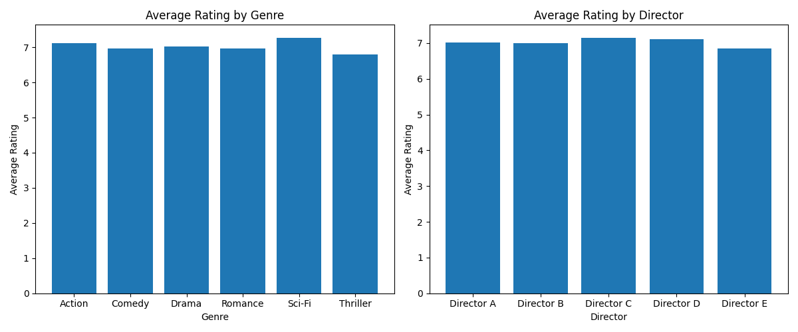
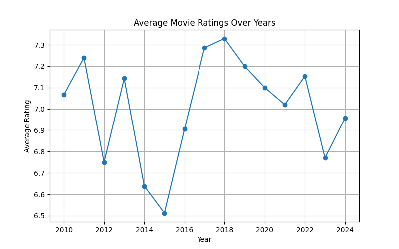
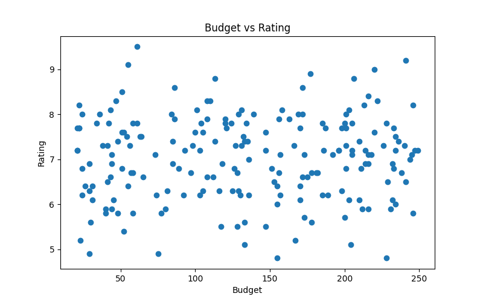
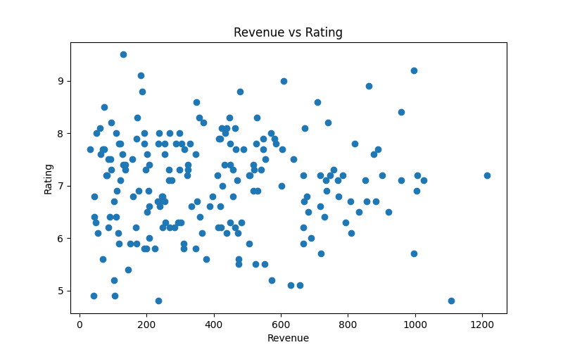
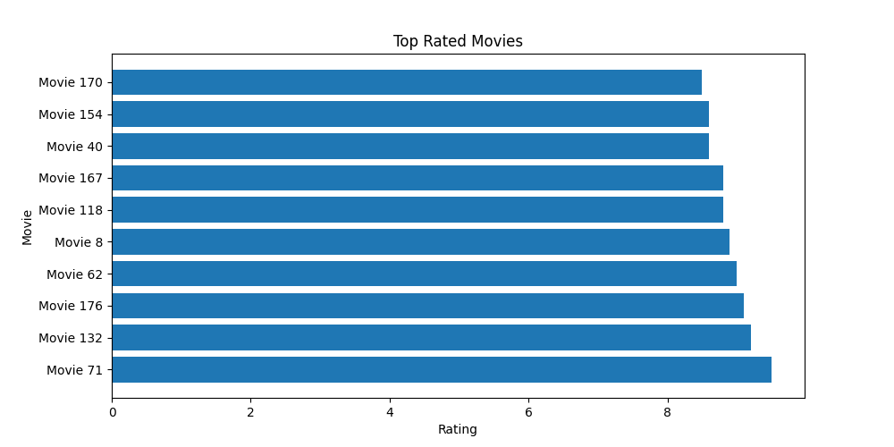

# Movie Data Analysis

## Project Overview

This project is a Python-based data analysis project that explores movie trends using Pandas, NumPy, and Matplotlib. The analysis focuses on movie ratings, genres, directors, budgets, and revenues to identify patterns and relationships within the dataset.

## Objectives

- Load and inspect movie data
- Clean and preprocess the dataset
- Perform statistical analysis using NumPy
- Analyze movie ratings by genre, director, and year
- Visualize trends and relationships using Matplotlib
- Identify top-rated movies

## Technologies Used

- Python
- Pandas
- NumPy
- Matplotlib
- Google Colab

## Dataset Features

The dataset contains the following attributes:

- Movie
- Genre
- Director
- Year
- Rating
- Budget
- Revenue

## Project Workflow

### 1. Data Loading and Inspection

- Loaded the dataset using Pandas
- Displayed the first few records using `head()`
- Examined dataset structure using `info()`
- Checked summary statistics using `describe()`

### 2. Data Cleaning

- Checked for missing values
- Removed missing records using `dropna()`
- Verified data quality before analysis

### 3. Statistical Analysis

Using NumPy, the following statistics were calculated:

- Mean
- Median
- Standard Deviation

For:

- Rating
- Budget
- Revenue

### 4. Genre Analysis

- Grouped movies by genre
- Calculated average rating for each genre
- Compared genre performance

### 5. Director Analysis

- Grouped movies by director
- Calculated average rating for each director
- Identified highly rated directors

### 6. Year-wise Analysis

- Grouped movies by year
- Calculated average rating per year
- Analyzed rating trends over time

## Visualizations

### Average Rating by Genre and Director

### Average Ratings Over Years

### Budget vs Rating

### Revenue vs Rating

### Top Rated Movies

## Project Files

- `Movie_Data_Analysis.ipynb`
- `movie_data_analysis.py`
- `movie_analysis_dataset.csv`
- `genre_director_rating_barplot.png`
- `year_rating_trend.png`
- `budget_vs_rating.png`
- `revenue_vs_rating.png`
- `top_rated_movies.png`

## Key Findings

- Average movie ratings were analyzed using statistical measures.
- Different genres showed varying average ratings.
- Directors exhibited differences in average movie performance.
- Rating trends changed across different years.
- Budget and revenue relationships with ratings were explored using scatter plots.
- Top-rated movies were identified through ranking analysis.

## Conclusion

This project demonstrates the use of Python for movie data analysis through data cleaning, statistical analysis, grouping operations, and visualization techniques. The results provide insights into movie performance, rating trends, and relationships between financial metrics and audience ratings.

## Future Improvements

- Analyze larger real-world movie datasets
- Add advanced visualizations using Seaborn
- Build an interactive dashboard using Power BI or Streamlit
- Apply machine learning models for movie rating prediction

---

### Author

**Ujjawal Chaudhary**

### Tools & Libraries

Python | Pandas | NumPy | Matplotlib | Google Colab
